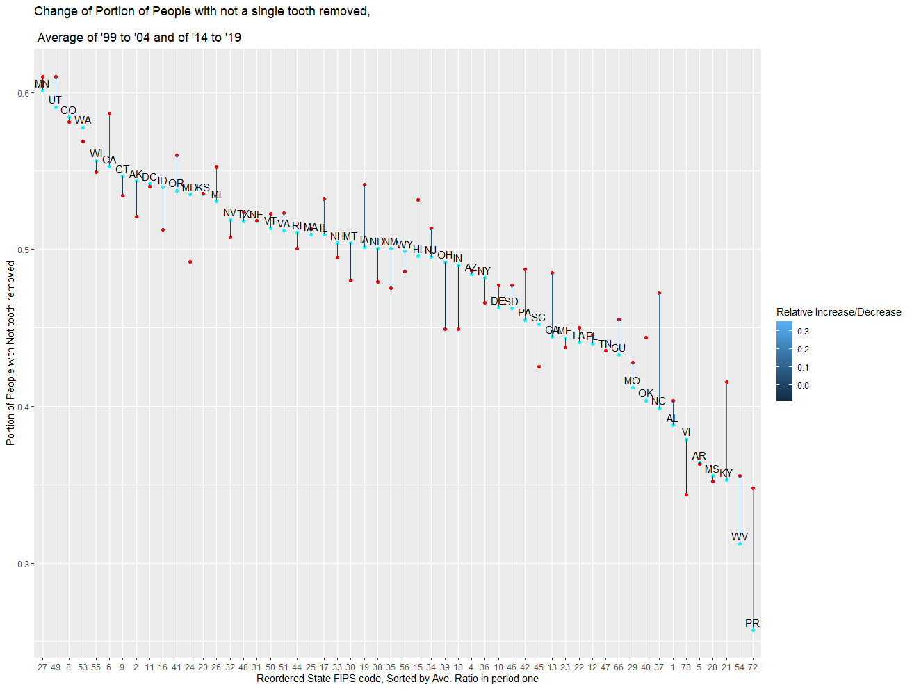
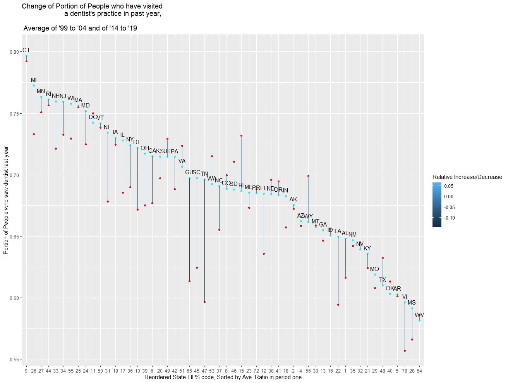

```{r setup, include=FALSE}
knitr::opts_chunk$set(echo = TRUE, warning = FALSE, message = FALSE)
```

## Introduction

This markdown file presents the ways to replicate change-by-state function, which shows how one variable changed over years for each state. The function were available for both BRFSS (Behavioral Risk Factor Surveillance System) and BLS (Bureau of Labor Statistics) data.

This RMD (R Markdown) file had been knitted into a PDF file for easier reading. PDF file and R Markdown file(end with .rmd) are all included in the directory under the same name. To reproduce the code, open the R Markdown in RStudio, then run the whole markdown file.

To get a LaTeX file of the document, add "keep_tex: true" below the pdf_output: line, in the header section of R Markdown. Then, knit the whole markdown file.

Make sure the file is located in $/$Graphic_Reproduction_Folder, with directory BRFSS_Data in the same directory containing $/$Graphic_Reproduction_Folder.

Make sure the following files are in place at BRFSS_Data folder:

>>Processed_BRFSS_1999_to_2020.csv. This can be gained by running BRFSS_Fractured_Download_Process.R under Default parameters.

>>Wages_By_State.csv and Employement_By_State.csv. This can be gained by running BLS_Download_State_Level.R in BLS_Data and copy to BRFSS folder.

To use processed BRFSS Data of a different year range, change the parameter at the head of BRFSS_Fractured_Download_Process.R. See comment of that script for specific parameters to be used.

The following packages are used:

```{r}
library("readxl") ## To read Excel
library("dplyr") ## For better data processing
library("haven") ## To read and export DTA Files
library(tidyr) ## Tidy functions
library(cdlTools) ## To corresponde FIPS code to state names/abbreviations
library(ggplot2) ## To have easier time plotting in R
library(gridExtra) ## To place two plots by each other
```


use install.packages() to install if you haven't installed already.


And read the file:

```{r}
Data = read.csv(file = "./../BRFSS_Data/Processed_BRFSS_1999_to_2020.csv", 
                stringsAsFactors = FALSE)

# Specifics: In this dataset, only the specific subdivision of occupations, such as dentist, general, family practitioners, were recorded
BLS_Data_Specifics = read.csv(file = "./../BRFSS_Data/Wages_By_State.csv", 
                              stringsAsFactors = FALSE)

# General: In this dataset, general division of occupations, such as dentist, all, and physicians and surgeons, all, were recorded as well.
BLS_Data_General = read.csv(file = "./../BRFSS_Data/Employment_By_State.csv", 
                            stringsAsFactors = FALSE)

```

The Data should be individual entries accumulated over time, each entry representing a respondent. It have to be processed before using later on.

## Example Graphic One

The graphic here is of same format of the ones we are creating here today. It is placed for you to have a general idea on the kind of graphic we are using.



The Graphic shows the change of the portion of people who have not had a single teeth removed. The cyan dots represents the average of such ratio, of each state, over year 1999 to year 2004. The red dot are same variable, but over year 2014 and 2019. The lines connecting two dot represents the change of the same state over year, while its color, referring to the scale at the right side, refers to the percentage of changes.

## Processing Data, for BLS

Since not much of this kind of graphic were asked, I didn't use a function to trim the data to be used for plotting. Instead, I put in extensive instructions on where to replace and change if you want to plot other data.

It is also because that switching between variable names, which must be edited as character then used in formula, imposed difficulty. Meanwhile difference in variables also imposed problem. 

The one variable would be separated and averaged for two periods of time, as two variables, which would then be plotted with changes in each state. The following function is a processor that takes a dataframe and trim it to what we need for plotting. The resulting dataset would have two useful columns consisting one variable in input data frame, averaged or summed over two periods of time. It could thus be used to reflect changes over time.

Required Input:

>>Input_Data: A data frame with year-state accuracy. 

>>Var_Name: A character, the name of the variable that is to be processed (and thus plotted later on)

>>Year_Var_Name: Character, the name of the variable indicating the year of entry. For BLS, it is "year". For BRFSS, it is "YEAR_RESPONSE"

>>State_Var_Name: Character, the name of the variable indicating the state of the entry. For BLS, it is "st", which is abbreviation of states' name. For BRFSS, either "State" (full name of states) or "STATE_FIPS_CODE" (FIPS code of states) shall work.

>>Sum_or_Average: For two year periods, shall the result do sum or average? Only two options, "Sum" and "Average" are available, and default "Average".

>>first_period: first year period to be used. As a two-element numeric vector, with default c(1999, 2004)

>>first_period: second year period to be used. As a two-element numeric vector, with default c(2014, 2019)

Technical details are below in comments

```{r}


By_Year_Operation = function(Input_Data, Var_Name, 
         Year_Var_Name, 
         State_Var_Name, Sum_or_Average = "Average",
         first_period = c(1999, 2004), 
         second_period = c(2014, 2019)){
  
  temp1 = Input_Data %>%
    filter(get(Year_Var_Name) >= first_period[1] & 
             get(Year_Var_Name) <= first_period[2])
  
  temp2 = Input_Data %>%
    filter(get(Year_Var_Name) >= second_period[1] & 
             get(Year_Var_Name) <= second_period[2])
  ### Filter the data into two parts,
  ### Each only taking from the year designated by 
  ### first_period and second_period
  
  if(Sum_or_Average == "Average"){
    Var_Name_1 = paste(Var_Name, "_Average_",
                             first_period[1], "_", first_period[2],
                             sep = "")
    ### Designate variable names for the first period.
    ### Format: Original_Var_Name_Average_begin_year_end_year.
    
    Var_Name_2 = paste(Var_Name, "_Average_",
                             second_period[1], "_", second_period[2],
                             sep = "")
    
    temp1 = temp1 %>% 
      group_by_at(State_Var_Name) %>%
      summarise_at(Var_Name, mean, na.rm = TRUE) %>%
      rename_at(Var_Name, 
                ~Var_Name_1)
    
    ### For each state, find the mean of the variable
    ### Designated by input Var_Name. This dataset,
    ### the temp1, shall consist only entries from the first period,
    ### Thus directly summarising would be of no problem.
    ### The variable would be renamed for later use.
    
    temp2 = temp2 %>% 
      group_by_at(State_Var_Name) %>%
      summarise_at(Var_Name, mean, na.rm = TRUE) %>%
      rename_at(Var_Name, 
                ~Var_Name_2)
    
    ### Same for second part (for second period)

  }else if(Sum_or_Average == "Sum"){
    Var_Name_1 = paste(Var_Name, "_Sum_",
                             first_period[1], "_", first_period[2],
                             sep = "")
    
    Var_Name_2 = paste(Var_Name, "_Sum_",
                             second_period[1], "_", second_period[2],
                             sep = "")
    
    temp1 = temp1 %>% 
      group_by_at(State_Var_Name) %>%
      summarise_at(Var_Name, sum, na.rm = TRUE) %>%
      rename_at(Var_Name, 
                ~Var_Name_1)
    
    temp2 = temp2 %>% 
      group_by_at(State_Var_Name) %>%
      summarise_at(Var_Name, sum, na.rm = TRUE) %>%
      rename_at(Var_Name, 
                ~Var_Name_2)
    
    ### Doing the same thing except changing Average to Sum
  }
  
  temp = left_join(temp1, temp2, by = State_Var_Name)
  ## Merge the dataset, by State_Var_Name, the name 
  ## for the variable which shows which state the entry represents.
  
  temp = as.data.frame(temp)
  
  temp$Diff_Ratio = (temp[, Var_Name_2] - temp[, Var_Name_1]) /
    temp[, Var_Name_1]
  ### Find the relative difference.
  ### Formula: (Result of second period - Result first period)/Res. 2nd period
  
  
  temp$State_FIPS_Code = fips(temp[, State_Var_Name], to = "fips")
  ### Convert whatever state_var you used into FIPS code, for easier plotting.
  
  
  return(temp)
  
         }


```

## Process the BRFSS Data

Upon plotting the BRFSS Data, we need it to be in State-Year format not unlike the BLS Data. As such, the same function used for BRFSS data in BRFSS_Graphic_Reproduction.RMD were simply copied here, and please refer to it for more specific information. Still, all technical comments were kept here. Namely, the Data_Condensor function takes a BRFSS dataset, raw, and a few parameters. It will give out state-year data on one or two variables.

```{r}
## This is actually the same as another script

Data_Range_Checker = function(Input_Data, Var){
  temp = Input_Data %>% group_by(STATE_FIPS_CODE, YEAR_RESPONSE) %>%
    summarize(Temp1 = across({{ Var }}, sum, na.rm = TRUE)) %>%
    mutate(Temp1 = as.numeric(unlist(Temp1)))
  temp = temp[temp$Temp1 > 0, ]
  return(temp[, 1:2])
}

Data_Condensor = function(Input_Data, Var1, Var2 = NA,
                          Var1_Condition, Var1_Denominator_Values = NA,
                          Var2_Condition = NA, Var2_Denominator_Values = NA,
                          Num_or_Ratio = "Ratio", Rename_Columns = FALSE,
                          year_begin = 1999, year_end = 2020){
  
  
  temp = Input_Data %>%
    filter(YEAR_RESPONSE >= year_begin & YEAR_RESPONSE <= year_end)
  ### Filter the data with year range
  
  year_List_1 = Data_Range_Checker(temp, Var1)
  ### This year_list_1 tells us which state-year these data would be available
  
  if(!is.na(Var2)){
    ### If var2 is not NA, meaning that there is an entry, also check the range
    ### for var2.
    year_List_2 = Data_Range_Checker(temp, Var2)
    
    ### Left-Join it with year range for Var1. 
    ### Keeps only common elements, so that year-state left here is available
    ### All the year.
    year_state_List = inner_join(year_List_1, year_List_2)
    
  }else{
    year_state_List = year_List_1
  }
  
  temp = inner_join(temp, year_state_List)
  ###Keer only state-year that have got available data
  
  if(TRUE %in% is.na(Var1_Denominator_Values)){
    # No entry is for Var1_Denominator_Values. Use Default Setting.
    # Contain everything that ain't not Don't Know, Unsure, or refused.
    # According to codebook, it shall be 1:9 without 7 and 9.
    Var1_Denominator_Values = c(1:6, 8)
  }
  
  # Sum up by state-year, drop those with too small a sample size.
  First_Var_Result = mutate(temp, 
                            Var1_Mask = ifelse(temp[, Var1] %in% Var1_Condition, 
                                               1, 0)) %>% 
    ### Gives 1 to a temporary variable if the Var1
    ### Fits in condition
    mutate(temp, Var1_Denominator_Count = 
             ifelse(temp[, Var1] %in% Var1_Denominator_Values, 1, 0)) %>%
    ### Give 1 to a temporary variable if Var1 fits in
    ### Denominator Value.
    group_by(STATE_FIPS_CODE, YEAR_RESPONSE) %>% 
    summarize(Var1_Fit_Condition_Sum = sum(Var1_Mask, na.rm = TRUE), 
              Var1_Total = sum(Var1_Denominator_Count, na.rm = TRUE)) %>%
    ### Sum the previous temporary variables by state-year 
    ### And write them in two variables for use later on.
    filter(Var1_Fit_Condition_Sum >= 100)
  
  if(!is.na(Var2)){
    # Var2 is default NA.
    # If anything was put onto Var2, then this chunk shall run, doing the same thing as above.
    
    if(TRUE %in% is.na(Var2_Denominator_Values)){
      Var2_Denominator_Values = c(1:6, 8)
    }
    Second_Var_Result = temp %>% 
      mutate(Var2_Mask = ifelse(temp[, Var2] %in% Var2_Condition, 1, 0)) %>% 
      mutate(temp, Var2_Denominator_Count = 
               ifelse(temp[, Var2] %in% Var2_Denominator_Values, 1, 0)) %>%
      group_by(STATE_FIPS_CODE, YEAR_RESPONSE) %>% 
      summarize(Var2_Fit_Condition_Sum = sum(Var2_Mask, na.rm = TRUE), 
                Var2_Total = sum(Var2_Denominator_Count, na.rm = TRUE)) %>%
      filter(Var2_Fit_Condition_Sum >= 100)
    
    ### Re-write temp dataframe as inner-join of the 
    ### result from calculating two variables
    temp = inner_join(First_Var_Result, Second_Var_Result)
  }else{
    ### No variable 2. Use only variable 1 result.
    temp = First_Var_Result
  }
  
  
  if(Num_or_Ratio == "Ratio"){
    # Find ratios for var1.
    temp = temp %>% mutate(Var1_Ratio = Var1_Fit_Condition_Sum / Var1_Total)
    # rename, if Rename_Columns was TRUE.
    if(Rename_Columns){
      temp = temp %>% 
        rename_at(vars(c("Var1_Fit_Condition_Sum", "Var1_Total", "Var1_Ratio")),
                  ~ c(paste(Var1, "_Fit_Condition_Count", sep = ""),
                      paste(Var1, "_Total", sep = ""),
                      paste(Var1, "_Ratio", sep = "")))
    }
    if(!is.na(Var2)){
      # Do the same thing for Var2, if it was calculated.
      temp = temp %>% 
        mutate(Var2_Ratio = Var2_Fit_Condition_Sum / Var2_Total)
      if(Rename_Columns){
        temp = temp %>% 
          rename_at(vars(c("Var2_Fit_Condition_Sum", 
                           "Var2_Total", "Var2_Ratio")),
                    ~ c(paste(Var2, "_Fit_Condition_Count", sep = ""),
                        paste(Var2, "_Total", sep = ""),
                        paste(Var2, "_Ratio", sep = "")))
      }
    }
  }
  else{
    ### No Ratio Calculated. Do Rename here.
    if(Rename_Columns){
      temp = temp %>% 
        rename_at(vars(c("Var1_Fit_Condition_Sum", "Var1_Total")), 
                  ~ c(paste(Var1, "_Fit_Condition_Count", sep = ""),
                      paste(Var1, "_Total", sep = "")))
    }
    if(!is.na(Var2)){
      temp = temp %>% mutate(Var2_Ratio = Var2_Fit_Condition_Sum / Var2_Total)
      if(Rename_Columns){
        temp = temp %>% 
          rename_at(vars(c("Var2_Fit_Condition_Sum", "Var2_Total")), 
                    ~ c(paste(Var2, "_Fit_Condition_Count", sep = ""),
                        paste(Var2, "_Total", sep = "")))
      }
    }
  }
  return(temp)
}

```


## Function for plotting

This is a function to actually plot the area. Nothing would be returned, except a plot shown. The required dataset input are as the following:

>> Input_Data: Input data, by state level. Designed for output from previous By_Year_Operation function, but other data can be acceptable.

>> Make Sure that State_FIPS_Code would be available for the dataset. It is useful in determining X-coordinate. It can be gained by using fips function for names or abbreviation of states. You can change it to any NUMERICAL values WITHIN the function.

>>Var_Name_1 and Var_Name_2: Two variables would be used to create a segment, which represents the change over time. It is adviced that the two variable names should be the two variable calculated from By_Year_Operation function, though you can still use other or any two variables.

>> The plot shall start at a scatterplot, each point represent a state and Var_Name_1 value, decreasing order. The same state's Var_Name_2 value would then be added, and the two Var_Name shall be connected by a line for clarity.

>>Change_Var_Name: Name of the variable whose change were reflected by the chart. Also, the label given to the Y-axis

>>State_Var_Name: Name of the variable representing the state. It would also be added as a label for each entry. It should 

>>Title_Name: Character, the title of the plot.

>>Label_Size: Size of the labels on the plot. Default is 5, which works well if you put the plot onto fullscreen. It is advised to use 2 if you are putting it on document, because too large a size cause labels to overlap each other.

>>label_x_shift: There would be label indicating the state of data point at around point showing Var_Name_1 values. This value, label_x_shift, asks how much shift would the label have from the data point at X-axis, positive for right side and negative left. Default is 0.

>>label_y_shift: There would be label indicating the state of data point at around point showing Var_Name_1 values. This value, label_y_shift, asks how much shift would the label have from the data point at Y-axis, positive for upper side and negative lower. Default is -.1.

For a clearer understanding, here is another example graphic, on the portion of people who have been to a dentist's practice in past 12 month, averaged over '99 to '04 and '14 to '19 for each state, represented by cyan and red dot respectively.



Var_Name_1 would be shown as Y-coordiante of cyan dots. Var_Name_2 would be shown as Y-coordinate of red dots. The X-coordinates would matter little and is just FIPS code by state re-ordered by decreasing order of Var_Name_1. Title_Name gives the upper title. Change_Var_Name is at the left by Y-axis. label_size refers to the size of labels indicating which state the data point belongs to, the two-letter abbreviation near cyan points in the graphic above.

Technical detals and description for each function are in the comments.


```{r}
State_Change_Plotter = function(Input_Data, Change_Var_Name,
                                Var_Name_1,
                                Var_Name_2, State_Var_Name,
                                Title_Name, label_size = 5,
                                label_x_shift = 0,
                                label_y_shift = -.015){
  
  Input_Data = as.data.frame(Input_Data) ## To prevent problems

  if(!("Diff_Ratio" %in% colnames(Input_Data))){
    temp$Diff_Ratio = (temp[, Var_Name_2] - temp[, Var_Name_1]) /
      temp[, Var_Name_1]
    ### Find the ratio of difference between two variables to be plotted
    ### And compared, if not already done earlier.
  }
  if(!("State_FIPS_Code" %in% colnames(Input_Data))){
    temp$State_FIPS_Code = fips(Input_Data[, State_Var_Name],
                                to = "fips")
    ### Find the FIPS code if not done already.
  }
  
  ggplot(data = Input_Data,
       aes(x = reorder(State_FIPS_Code, -get(Var_Name_1))) ) +
  ## The base of the plot.
  ## the reorder plot shall re-order State_FIPS_Code value at Decreasing
  ## order of the values in Var_Name_1. The get() function was used
  ## because Var_Name began as a string and cannot be read directly 
  ## by aes.
    
  geom_point(aes_string(y = Var_Name_1), col = "cyan") +
    ### Get the Y-coordinate of some of the scatterplot.
    ## Namely, the ones represented by Var_Name_1, colorded Cyan.
    ## Here, there were no get() function because we are using
    ## aes_string, which can have string input for its parameters,
    ## should such string refers to one of the variable names.
    
    
  geom_point(aes_string(y = Var_Name_2), col = "red") +
    ## Another point, for values in Var_Name_2
    ## The X-coordinate were not defined here so should just inherit from
    ## the first ggplot function.
    
  labs(y = Change_Var_Name,
       x = "Reordered State FIPS code, Sorted by Ave. Ratio in period one",
       color = "Inc/Dec") +
    ### X and Y axis name, and label for the color of the segment.
    
  geom_segment(aes(x = reorder(State_FIPS_Code, -get(Var_Name_1)), 
                     xend = reorder(State_FIPS_Code, -get(Var_Name_1)),
                     y = get(Var_Name_1), yend = get(Var_Name_2),
                     col = Diff_Ratio)) +
    ### Okay so here we have the segmented plot.
    ### The segement connects (x,y) and (xend, yend)
    ### X-coordinate just inherit from previously, using same formula.
    ### X-end should be same as x, as written above.
    ### y-coordinates and yend should be values of Var_Name_1
    ### and Var_Name_2 respectively. Those are also coordinates
    ### of the two plots we made earlier.
    ### The color depends on diff_ratio.
    
  geom_text(label = Input_Data[, State_Var_Name], 
            aes(x = reorder(State_FIPS_Code, -get(Var_Name_1)), 
                            y = get(Var_Name_1)),
            nudge_x = label_x_shift, 
            nudge_y = label_y_shift,
            size = label_size) +
    ### Label the text with coordinates for points showing values of Var_Name_1
    ### nudge the label as given in input
    ### label shall be the state_var_name
    
  ggtitle(Title_Name)
  ### Add the title
}
```

## Examples for BLS Data.
There are several examples. The following chart use BLS Data to picture the change of dental hygienist per 1,000 people from averages of '99 to '04 to average of '14 to '19. Technical details are written below

```{r}
BLS_Data_General_For_Plotting = 
  BLS_Data_General[BLS_Data_General$occ_code == 2021, ]
### 29-2021 is the BLS code for dental hygienists.
### This includes only dental hygienist in the dataset

BLS_Data_General_For_Plotting$Dtl_Hyg_per_1K_Pop = 
  BLS_Data_General_For_Plotting$tot_employment /
  BLS_Data_General_For_Plotting$Est_Population * 1000
### Find the dental hygienist per 1,000 people data, for each state-year
### Named as Dtl_Hyg_per_1K_Pop

BLS_Data_General_For_Plotting = 
  By_Year_Operation(Input_Data = BLS_Data_General_For_Plotting,
                       Var_Name = "Dtl_Hyg_per_1K_Pop",
                       Year_Var_Name = "year",
                       State_Var_Name = "st")
### Process the data and find averages over two period
### of variable Dtl_Hyg_per_1K_Pop.
### Used default 1999 to 2004 average and 2014 to 2019 average.

State_Change_Plotter(Input_Data = BLS_Data_General_For_Plotting,
                     Change_Var_Name = "Dental Hygienist per 1,000 people",
                     Var_Name_1 = "Dtl_Hyg_per_1K_Pop_Average_1999_2004",
                     Var_Name_2 = "Dtl_Hyg_per_1K_Pop_Average_2014_2019",
                     State_Var_Name = "st", 
                     Title_Name = "Dental Hygienist per 1,000 people \n
                     Change in 5-year average",
                     label_size = 2)
### Plotting, with self-designated title, Y-label, etc.
```

We also have a graphic for averaged annual income of dentists (all dentists, including surgeons etc. Averages were weighed by employment.)
The two periods of average is still 1999 to 2004 and 2014 to 2019.


```{r}
BLS_Data_General_For_Plotting = 
  BLS_Data_General[BLS_Data_General$occ_code == 1020, ]


BLS_Data_General_For_Plotting = 
  By_Year_Operation(Input_Data = BLS_Data_General_For_Plotting,
                       Var_Name = "annual_mean_income",
                       Year_Var_Name = "year",
                       State_Var_Name = "st")

State_Change_Plotter(Input_Data = BLS_Data_General_For_Plotting,
                     Change_Var_Name = "Average Annual Income of Dentists",
                     Var_Name_1 = colnames(BLS_Data_General_For_Plotting)[2],
                     Var_Name_2 = colnames(BLS_Data_General_For_Plotting)[3],
                     State_Var_Name = "st", 
                     Title_Name = "Average Annual Income of Dentists \n
                     Change in 5-year average",
                     label_size = 2,
                     label_y_shift = -1600)
### Here, since the value is usually some 100,000 to 200,000
## shifting down 1,600 is not bad
```

## Example: BRFSS Data

Firstly, we replicate the graphic we used at foremost as an example, which is for the portion of people who have not a single teeth removed, with averages from '99 to '04 and '14 to '19.

```{r}
BRFSS_Example_1 = Data_Condensor(
  Input_Data = Data, Var1 = "NO_TEETH_RMVD", 
  Var1_Condition = 8, Rename_Columns = TRUE)

BRFSS_Example_1$st = fips(BRFSS_Example_1$STATE_FIPS_CODE, to = "abbreviation")

BRFSS_Example_1 = By_Year_Operation(Input_Data = BRFSS_Example_1,
                       Var_Name = "NO_TEETH_RMVD_Ratio",
                       Year_Var_Name = "YEAR_RESPONSE",
                       State_Var_Name = "st")

State_Change_Plotter(Input_Data = BRFSS_Example_1,
                     Change_Var_Name = "Portion of People with Not tooth removed",
                     Var_Name_1 = colnames(BRFSS_Example_1)[2],
                     Var_Name_2 = colnames(BRFSS_Example_1)[3],
                      Title_Name = "Change of Portion of People with not a single tooth removed, 
                     \n Average of '99 to '04 and of '14 to '19",
                     State_Var_Name = "st", label_size = 2)
```

Secondly, we replicate the graphic we used in previous "Function for Plotting" as an example, which is for the portion of people who have visited a dentist's practice, with averages from '99 to '04 and '14 to '19.

```{r}
BRFSS_Example_1 = Data_Condensor(
  Input_Data = Data, Var1 = "DENTIST_VISIT_LAST", 
  Var1_Condition = 1, Rename_Columns = TRUE)

BRFSS_Example_1$st = fips(BRFSS_Example_1$STATE_FIPS_CODE, to = "abbreviation")

BRFSS_Example_1 = By_Year_Operation(Input_Data = BRFSS_Example_1,
                       Var_Name = "DENTIST_VISIT_LAST_Ratio",
                       Year_Var_Name = "YEAR_RESPONSE",
                       State_Var_Name = "st")

State_Change_Plotter(Input_Data = BRFSS_Example_1,
                     Change_Var_Name = "Portion of People who saw dentist last year",
                     Var_Name_1 = colnames(BRFSS_Example_1)[2],
                     Var_Name_2 = colnames(BRFSS_Example_1)[3],
                      Title_Name = "Change of Portion of People who have visited 
                      a dentist's practice in past year, 
                     \n Average of '99 to '04 and of '14 to '19",
                     State_Var_Name = "st", label_size = 2)
```

Finally, we produce a graph for the portion of people who have medical insurance coverage, with averages from '99 to '04 and '14 to '19.


```{r}
BRFSS_Example_1 = Data_Condensor(
  Input_Data = Data, Var1 = "HEALTH_PLAN_STATUS", 
  Var1_Condition = 1, Rename_Columns = TRUE)

BRFSS_Example_1$st = fips(BRFSS_Example_1$STATE_FIPS_CODE, to = "abbreviation")

BRFSS_Example_1 = By_Year_Operation(Input_Data = BRFSS_Example_1,
                       Var_Name = "HEALTH_PLAN_STATUS_Ratio",
                       Year_Var_Name = "YEAR_RESPONSE",
                       State_Var_Name = "st")

State_Change_Plotter(Input_Data = BRFSS_Example_1,
                     Change_Var_Name = "Portion of People with Health Plan",
                     Var_Name_1 = colnames(BRFSS_Example_1)[2],
                     Var_Name_2 = colnames(BRFSS_Example_1)[3],
                     Title_Name = "Change of Portion of People with health plan, 
                     \n Average of '99 to '04 and of '14 to '19",
                     State_Var_Name = "st", label_size = 2)


```


## Scatterplot Comparison

It is also possible to compare two variables of BLS, side-by-side. Namely, there will two graphics, each showing a scatterplot of two variables, placed side by side. It was created so that some changes could be seen relatively easily. The data processing part can be handled relatively easily with our previous functions, but it still requires some additional code to do the plotting.

As an example, we will use BLS Data with dental hygienist and dentist per 1,000 people in two periods.

```{r}
BLS_temp_1 = BLS_Data_General[BLS_Data_General$occ_code == 1020, ]

BLS_temp_1$Dentist_per_1K_Pop = 
  BLS_temp_1$tot_employment / BLS_temp_1$Est_Population * 1000
### Find the dentist per 1,000 people data, for each state-year
### Named as Dentist_per_1K_Pop

BLS_temp_1 = 
  By_Year_Operation(Input_Data = BLS_temp_1,
                       Var_Name = "Dentist_per_1K_Pop",
                       Year_Var_Name = "year",
                       State_Var_Name = "st")

BLS_temp_2 = BLS_Data_General[BLS_Data_General$occ_code == 2021, ]

BLS_temp_2$Dtl_Hyg_per_1K_Pop = 
  BLS_temp_2$tot_employment / BLS_temp_2$Est_Population * 1000
### Find the dental hygienist per 1,000 people data, for each state-year
### Named as Dtl_Hyg_per_1K_Pop

BLS_temp_2 = 
  By_Year_Operation(Input_Data = BLS_temp_2,
                       Var_Name = "Dtl_Hyg_per_1K_Pop",
                       Year_Var_Name = "year",
                       State_Var_Name = "st")

BLS_Data_General_For_Plotting = left_join(BLS_temp_1, BLS_temp_2,
                                          by = "st")


```


It quickly comes to be that the parameters required---labels and titles and data frams for two functions--appears to be too much. Thus, instead of a function with over 10 parameters, I decided to use the raw code, with instructions below on what could be changed easily within the coding. Since this is actually only two simple ggplot added together, much could be done with it.

The chunk shows the first (left) part of the graphic to be shown.

```{r}

## Plot them.
A = ggplot(data = BLS_Data_General_For_Plotting,
       aes(x = Dentist_per_1K_Pop_Average_1999_2004, 
           y = Dtl_Hyg_per_1K_Pop_Average_1999_2004)) +
  ### Here, you can actually change to whatever dataset with two variables
  ### Just like any ggplot plot.
  
  geom_point() +
  ### To plot scatterplot.
  
  labs(y = "Dental Hygienist per Dentist",
       x = "Number of Dentist per 1,000 people") +
  ### Add labels for X and Y axis
  
  geom_text(label = BLS_Data_General_For_Plotting$st, 
            aes(x = Dentist_per_1K_Pop_Average_1999_2004, 
                                       y = Dtl_Hyg_per_1K_Pop_Average_1999_2004),
            nudge_x = 0, nudge_y = .1) +
  ### Add labels to each data point.
  ### The label = argument will be shown at places designated by x-y coordinates
  ### in aes, and the text shown is what was take in label = argument.
  ### The label should be a column from the dataset which were used for plotting 
  ### The X-Y coordinates were designated in aes(), using the same as 
  ### What the plot began with, though you can change it.
  
  xlim(0, .6) + ylim(0, 1.3) +
  ### It is advised to fix the X and Y limit if 
  ### you want to have sensible comparison
  
  geom_smooth(method = "lm") +
  ### Add a regression line.
  ggtitle("Dental Hygienist and Dentist per 1,000 people, \n
          Averaged '99 to '04")
```

The second part should be mostly the same in terms of technical details. Like any GGPLot it can be customized. While I used the same dataset and two different variables, you can use whatever you want.

```{r}
B = ggplot(data = BLS_Data_General_For_Plotting,
       aes(x = Dentist_per_1K_Pop_Average_2014_2019, 
           y = Dtl_Hyg_per_1K_Pop_Average_2014_2019)) +
  geom_point() +
  labs(y = "Dental Hygienist per Dentist",
       x = "Number of Dentist per 1,000 people") +
  geom_text(label = BLS_Data_General_For_Plotting$st, 
            aes(x = Dentist_per_1K_Pop_Average_2014_2019, 
                                       y = Dtl_Hyg_per_1K_Pop_Average_2014_2019),
            nudge_x = 0, nudge_y = .1) +
  xlim(0, .6) + ylim(0, 1.3) +
  geom_smooth(method = "lm") +
  ggtitle("Dental Hygienist and Dentist per 1,000 people, \n
          Averaged '14 to '19")

grid.arrange(A, B, ncol = 2)

```

Another example would be finding the correlation of two variables, dental hygienist per dentist to dentist per 1,000 population. Here is the plotting used.

The data processing part was hidden because it consisted mainly primitive techniques and writing them would use up simply too much space. 

```{r echo = FALSE, message = FALSE, results='hide'}

# Find average employment over years. Here is 1999 to 2004
BLS1 = BLS_Data_General %>%
  filter(year <= 2004 & year >= 1999) %>% #Year Range
  filter(occ_code == 1020 | occ_code == 2021) %>% #Use only dentists and Dental hygienists
  mutate(across(everything(), ~ifelse(.x==0, NA, .x))) %>% #Change all 0 entries, which are useless, to NA
  group_by(st, occ_code) %>%
  summarise(ave_employment = mean(tot_employment, na.rm = TRUE)) %>% 
  pivot_wider(names_from = "occ_code", values_from = ave_employment)
#Use averaged employment. NA ignored. Did so because we don't want useless 0 entries to slip into averages.

# Rename columns for easier use
if(colnames(BLS1)[2] == 1020){
  colnames(BLS1)[2] = "AVE_DENTIST_EMPLOYMENT"
  colnames(BLS1)[3] = "AVE_DENTAL_HYGIENIST_EMPLOYMENT"
}else if(colnames(BLS1)[2] == 2021){
  colnames(BLS1)[3] = "AVE_DENTIST_EMPLOYMENT"
  colnames(BLS1)[2] = "AVE_DENTAL_HYGIENIST_EMPLOYMENT"
}

# Find mean population
BLS1P =  BLS_Data_General %>%
  filter(year <= 2004 & year >= 1999) %>%
  group_by(st) %>%
  summarise(ave_pop = mean(Est_Population, na.rm = TRUE))

BLS1 = left_join(BLS1, BLS1P, by = "st")

BLS1 = BLS1 %>% mutate(Dtl_Hyg_per_Dentist_99_04 = AVE_DENTAL_HYGIENIST_EMPLOYMENT / AVE_DENTIST_EMPLOYMENT,
                       Dentist_per_1K_Pop_99_04 = 1000 * AVE_DENTAL_HYGIENIST_EMPLOYMENT / ave_pop) %>%
  mutate(State_FIPS_Code = fips(st))


# Do the same, but for '14 to '19
BLS2 = BLS_Data_General %>%
  filter(year <= 2019 & year >= 2014) %>%
  filter(occ_code == 1020 | occ_code == 2021) %>%
  mutate(across(everything(), ~ifelse(.x==0, NA, .x))) %>%
  group_by(st, occ_code) %>%
  summarise(ave_employment = mean(tot_employment, na.rm = TRUE)) %>%
  pivot_wider(names_from = "occ_code", values_from = ave_employment)


if(colnames(BLS2)[2] == 1020){
  colnames(BLS2)[2] = "AVE_DENTIST_EMPLOYMENT"
  colnames(BLS2)[3] = "AVE_DENTAL_HYGIENIST_EMPLOYMENT"
}else if(colnames(BLS2)[2] == 2021){
  colnames(BLS2)[3] = "AVE_DENTIST_EMPLOYMENT"
  colnames(BLS2)[2] = "AVE_DENTAL_HYGIENIST_EMPLOYMENT"
}

BLS2P =  BLS_Data_General %>%
  filter(year <= 2019 & year >= 2014) %>%
  group_by(st) %>%
  summarise(ave_pop_14_19 = mean(Est_Population, na.rm = TRUE))

BLS2 = left_join(BLS2, BLS2P, by = "st")

BLS2 = BLS2 %>% mutate(Dtl_Hyg_per_Dentist_14_19 = AVE_DENTAL_HYGIENIST_EMPLOYMENT / AVE_DENTIST_EMPLOYMENT,
                       Dentist_per_1K_Pop_14_19 = 1000 * AVE_DENTAL_HYGIENIST_EMPLOYMENT / ave_pop_14_19) %>%
  mutate(State_FIPS_Code = fips(st))

BLS_Merged = inner_join(BLS1, BLS2, by = "st")
#BLS_Merged$ratio_99_order = order(BLS_Merged$Dtl_Hyg_per_Dentist_99_04)

BLS_Merged$Diff_Ratio = BLS_Merged$Dtl_Hyg_per_Dentist_14_19 - BLS_Merged$Dtl_Hyg_per_Dentist_99_04
```

And here is the plotting part. Output is BLS_Merged. Y-axis shows average dental hygienist to dentist ratio, and X-axis dentist per 1,000 people, averaged.

```{r fig.height = 16, fig.width=10}
## Plot them.
A = ggplot(data = BLS_Merged,
       aes(x = Dentist_per_1K_Pop_99_04, y = Dtl_Hyg_per_Dentist_99_04)) +
  geom_point() +
  labs(y = "Dental Hygienist per Dentist",
       x = "Number of Dentist per 1,000 people") +
  geom_text(label = BLS_Merged$st, aes(x = Dentist_per_1K_Pop_99_04, 
                                       y = Dtl_Hyg_per_Dentist_99_04),
            nudge_x = 0, nudge_y = .1) +
  xlim(.25, 1.1) + ylim(.5, 4.5) +
  geom_smooth(method = "lm") +
  ggtitle("Dental Hygienist per Dentist VS Dentist per 1,000 people, '99 to '04")

B = ggplot(data = BLS_Merged,
       aes(x = Dentist_per_1K_Pop_14_19, y = Dtl_Hyg_per_Dentist_14_19)) +
  geom_point() +
  labs(y = "Dental Hygienist per Dentist",
       x = "Number of Dentist per 1,000 people") +
  geom_text(label = BLS_Merged$st, aes(x = Dentist_per_1K_Pop_14_19, 
                                       y = Dtl_Hyg_per_Dentist_14_19),
            nudge_x = 0, nudge_y = .1) +
  xlim(.25, 1.1) + ylim(.5, 4.5) +
  geom_smooth(method = "lm") +
  ggtitle("Dental Hygienist per Dentist VS Dentist per 1,000 people, '14 to '19")


grid.arrange(A, B, nrow = 2)


```


